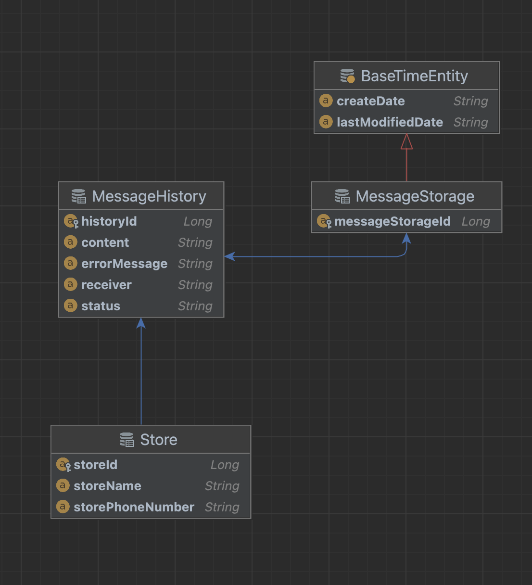

  <h2>개요</h2>

프로젝트 이름: Auto Message 
프로젝트 진행 기간: 24.04.28 ~ 24.07.01 
프로젝트 진행 사유: 매일 사진을 찍어 오늘 내려가는 배송품을 카카오톡으로 직접 가게별로 전송하는 작업은 시간적으로 비효율적이기에 해당 작업을 자동화해 소요하는 시간을 줄이기 위해 시작하였다.

 
<h2>사용 언어 및 기술</h2>

사용 언어 및 프레임 워크

    
    
    
    
    

사용 기술

    
    
    

<h2>아키텍처</h2>
<h3>시스템 아키텍처</h5>

<h3>DB ERD</h3>

 
  
<h2>주요 기능 구성</h2>

    

        Message Send (네이버 클라우드 sms 기능 사용)  
        네이버 클라우드에서 제공하는 SMS 송/수신 기능을 이용해 지정된 사용자에게 메시지를 전송하는 기능이다.
        Message Log  
        전송된 메시지 결과를 별도 DB에 저장해 전송 내역을 확인할 수 있는 기능이다. 
        Store (CRUD)  
        기본적인 가게 정보들을 저장 읽기 수정 삭제 기능을 제공한다. 
    

<h2>기술 사용 이유</h2>

<h3>CI/CD Github Action</h3>
지속적인 수정 배포 과정이 복잡하고 사용자 실수도 발생할 수 있다는 점에서 자동화 배포 기능이 필요하다 생각이 들어 GitHub Action을 이용해 CI/CD를 구현하게 되었습니다.
해당 기술을 선택한 이유는 서버 규모가 작고 다른 CI/CD 비교 했을 때 비용이 발생하지 않기에 선택하였습니다. 
현재 프로젝트에서는 AWS가 아닌 사용자 서버인 Synology Nas를 이용해 서버 배포를 하고 있기 때문에 필연적으로 서버 속도가 느리고 
떄문에 별도의 추가적인 자원을 사용하고 싶지 않았기 때문에 비용이 들지 않는다면 최대한 외부에서 처리하는 방식을 선택하고 싶었고 해당 조건이 Github Action과 일치하다 생각해 선택하게 되었다. 
또한 기존 AWS와는 다르게 실제 Synology Nas에 접근해 배포하기 위한 과정에 대해 공부하는 유의미한 경험을 하게 되었다.

<a href="https://zks145.tistory.com/121">Github Action CI/CD 무중단 배포 1편</a> 
<a href="https://zks145.tistory.com/123">Github Action CI/CD 무중단 배포 2편</a>
 

<h3>Synology Server</h3>
AWS 대신 Synology Nas를 이용한 이유는 비용 때문이였습니다. 
단기간 사용할 서버였다면 AWS를 이용해 서버 배포를 통해 여러가지 기능들을 사용해볼 기회도 있었겠지만 해당 서버는 지속적으로 사용해야 되는 서버이기 때문에 서버 기능과 속도를 포기하더라도 서버 규모면과 사용 시간등을 계산했을 때 합리적이라 생각이 들어 사용하게 되었습니다.

<a href="https://zks145.tistory.com/72">시놀로지 나스 도커를 이용한 DB 배포</a> 
<a href="https://zks145.tistory.com/114">시놀로지 나스 도커를 이용한 Spring Server 배포</a>

<h2>리팩토링</h2>
브랜치 분리 전략 자동화 배포시 발생하는 문제   
고정된 중복 코드를 Util class 분리 구현  
조회 쿼리 최소화로 성능 향상  
redis 이용한 refresh token 관리  
soft delete  

<h2>테스트</h2>
 
