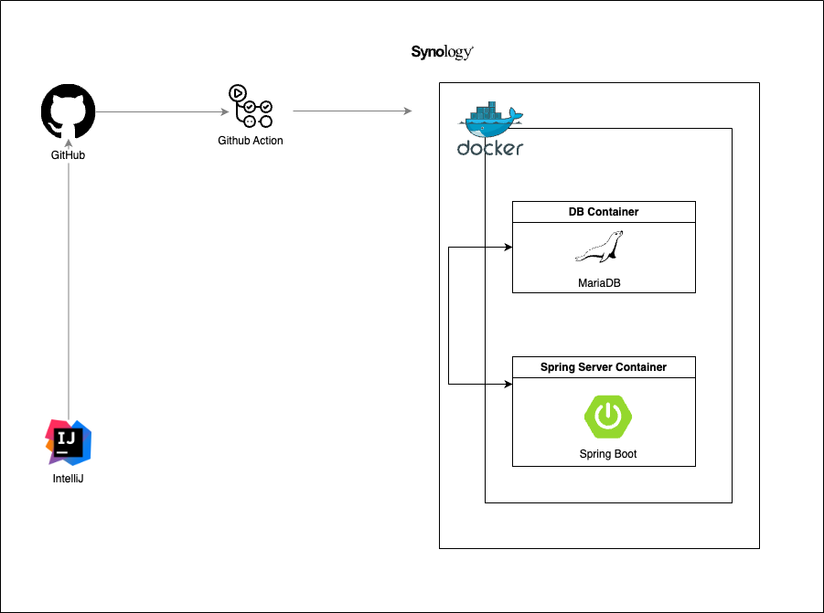
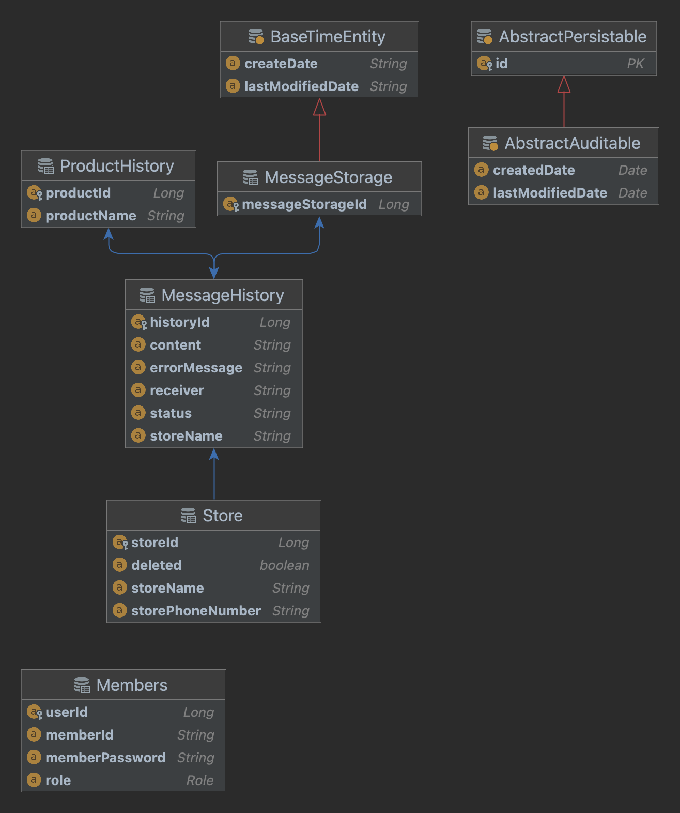

<h2>개요</h2>

프로젝트 이름: Auto Message 
프로젝트 진행 기간: 24.04.28 ~ 24.07.01 

프로젝트 진행 사유: 매일 사진을 찍어 오늘 내려가는 배송품을 카카오톡으로 직접 가게별로 전송하는 작업은 시간적으로 비효율적이기에 해당 작업을 자동화해 소요하는 시간을 줄이기 위해 시작하였습니다. 
프로젝트 리펙토링 기간: 24.07.24 ~ 24.08.31 
프로젝트 리펙토링 사유: 기존 Thymeleaf에서 사용된 javascript 코드를 thymeleaf 문법으로 최소화, 보안 강화를 위한 로그인 기능 추가였습니다.

<h2>사용 언어 및 기술</h2>

사용 언어 및 프레임 워크

    
    
    
    
    

사용 기술

    
    
    

<h2>아키텍처</h2>
<h3>시스템 아키텍처</h5>

<h3>DB ERD</h3>

 

    

주요 기능 구성

        <ol>
            <li><h5>Web Message Send (네이버 클라우드 Simple & Easy Notification Service 기능 사용)</h5>
            네이버 클라우드에서 제공하는 SMS 송/수신 기능을 이용해 지정된 사용자에게 메시지를 전송하는 기능입니다.
            <li><h5>Message Log</h5>
            전송된 메시지 결과를 별도 DB에 저장해 전송 내역을 확인할 수 있는 기능입니다. 
            <li><h5>Store (CRUD)</h5>
            기본적인 가게 정보들을 저장 읽기 수정 삭제 기능을 제공합니다. 
        </ol>
    

 

    

사용 기술 및 이유

        <h3>Synology Server</h3>
        

        AWS 대신 Synology Nas를 이용한 이유는 비용 때문이였습니다. 
        단기간 사용할 서버였다면 AWS를 이용해 서버 배포를 통해 여러가지 기능들을 사용해볼 기회도 있었겠지만 해당 서버는 지속적으로 사용해야 되는 서버이기 때문에 AWS의 다양한 
        서버 기능과 속도를 포기하더라도 서버 규모와 사용 시간등을 계산했을 때 합리적이라 생각이 들어 사용하게 되었습니다. 
        비록 부족하지만 클라우드 서버인 AWS와는 다른 Synology Nas에 접근해 배포하기 위한 과정에 대해 공부하는 유의미한 경험을 하게 되었습니다.
        

        <h3>CI/CD GitHub Action</h3>
        지속적인 수정 배포 과정이 복잡하고 사용자 실수도 발생할 수 있다는 점에서 자동화 배포 기능이 필요하다는 생각이 들어 GitHub Action을 이용해 CI/CD를 구현하게 되었습니다.
        해당 기술을 선택한 이유는 서버 규모가 작고 다른 CI/CD 비교 했을 때 추가 비용이 발생하지 않기에 선택하였습니다. 
        현재 프로젝트에서는 AWS가 아닌 개인 서버인 Synology Nas를 이용해 서버 유지를 하고 있기 때문에 서버 속도가 느리기
        떄문에 별도의 추가적인 자원을 사용 없이 최대한 외부 자원을 이용해 처리하는 방식을 선택하고 싶었고 추가 배포 없이 해당 조건에 만족하는 Github Action 선택하게 되었습니다.  
        <h4>배포 구조 변경 과정</h4>
        <ol>
            <li>Jar + Docker 직접 서버 파일 실행</li>
            <li>GitHub Action + Docker 자동 배포</li>
        

        초기에는 Java Jar 파일을 이용해 직접 생성해 도커에 올려 서버에 파일을 다운받아 서버를 껏다 키며 배포해줬습니다. 이 과정에서 불필요한 서버 배포 시간과 잘못된 서버 파일 배포 등의 인적오류가 발생하게 되었습니다.  
        때문에 사용자의 간섭없이 항상 동일한 프로세스를 진행할 방식을 찾다 GitHub Action을 이용한 자동화 파이프라인을 구성하게 되었습니다. 
        GitHub Action을 이용해 배포 서버에 코드 테스트를 자동을 진행하고 결과를 보고 Main 브랜치에 pull Request 하는 방식으로 배포 과정의 안정화 또한 갖추게 되었습니다.
        </ol>
        <h5>참고 자료</h5>
        <li><a href="https://zks145.tistory.com/114">Spring Boot Jar 배포 및 DB 연결</a></li>
        <li><a href="https://zks145.tistory.com/121">Github Action CI/CD 무중단 배포 1편</a></li>
        <li><a href="https://zks145.tistory.com/123">Github Action CI/CD 무중단 배포 2편</a></li>
        <h3>리펙토링: Spring Security와 Redis 세션 로그인 + 로그인 유지</h3>
        기존 서버는 로그인 서비스가 없어서 URL 접근만으로 내부 정보를 쉽게 볼 수 있는 보안 문제가 있었습니다. 
        이를 해결하기 위해 Spring Security를 도입하여 사용자 인증 및 권한 관리를 강화했습니다. 또한 Redis를 활용하여 세션 관리와 자동 로그인을 구현했습니다.
        <ol>
            <li style="font-weight: bold">Spring Security 역할: 인증 및 권한 관리</li>
            Spring Security는 강력한 보안 기능을 제공하는 프레임워크로 thymeleaf와도 결합이 가능해 강력한 인증/인가 기능 구현을 할 수 있습니다.
            Spring Security 고유 기능인 로그인 폼, 사용자 인증, 로그아웃과 같은 기능을 쉽게 구현해 서버 보안을 향상시킬 수 있었습니다.
            <li style="font-weight: bold">Redis 역할: 세션 관리 및 로그인 유지</li>
            Redis는 빠르고 가벼운 인메모리 데이터 저장소로 사용자 인증 세션 데이터를 저장하고 관리하는 사용하였습니다. 
            Redis를 사용한 이유로는 기본적으로 제공하는 TTL 기능으로 별도 스케줄링 코드를 작성하지 않아도 자동 만료가 되며 관리에 용이하였습니다.
        </ol>
        이 과정에서 SSR 방식에서는 jwt token을 사용하지 않는 이유에 대해 다시 한번 확인 시간도 가지게 되었습니다.
        <h5>참고 자료</h5>
        <li><a href="https://zks145.tistory.com/130">Spring Security와 Redis 이용한 로그인 세션 유지</a></li>
        <li><a href="https://zks145.tistory.com/106">SSR에서 JWT를 이용한 인증/인가 방식을 사용하지 않는 이유</a></li>
    

    

성과 및 아쉬운 점

    <h5>성과</h5>
        

            이번 프로젝트를 진행하며 단순히 이론적으로 알고 있던 지식을 활용하는 기회를 가지게 되었고 단순 기능 구현이 아닌 생각하고 필요에 따른 새로운 기술 구현을 할 기회가 생겼습니다. 
            구현 기능 자체는 단순하지만 해당 기능을 구현하며 왜 이 기술을 사용해야되는지 집중하고 공부하며 개발을 하게 되었습니다. 이 과정에서 좋은 개발자로 성장하기 위한 생각과 방법을 고민하는 시간을 가지게 되었습니다. 
        

    <h5>아쉬운 기획</h5>
        

            처음 프로젝트를 혼자 진행 한 만큼 초기 기획과정에서 기능 정의와 구현 그리고 목표들을 확실하게 잡고 들어가지 않은 점이 프로젝트 제작 기간을 늘린거 같습니다.
            초기 프로그램의 목표는 단순히 노가다로 매일 진행되던 메시지 전송 과정을 단순 자동화만 해보는 식으로 시작되었습니다.
            때문에 지금 구현된 기능들 중 계획을 잡고 구현을 시작한건 SMS 메시지를 자동으로 보내는 기능만 계획의 범위로 잡고 시작하게 되었습니다.  
            중간중간 추가되는 기능들 때문에 기존의 DB를 재구성하는 과정이 중간중간 추가되고 목표했던 기간을 넘게 되는 문제가 발생하였습니다. 
            다음 프로젝트에서는 명확한 기능 정의와 계획 작성을 통해 목표했던 기능을 제 시간에 구현할 수 있도록 개선하고자 합니다.
        

    <h5>아쉬운 기능</h5>
        

            이후 시간이 된다면 로그 모니터링(예: ELK) 구축해 오류가 발생하면 즉각적인 피드백이 가능하도록 만들어 보고 싶습니다. 
            사용 중 오류가 발생하면 로그를 일일이 찾아가며 수정해야 했던 경험은 경험이 매우 힘들었습니다.
            터미널 창에서 오류를 추적하고 분석하는 과정이 익숙하지 않았기 때문에 더욱 어려웠습니다. 
            현재는 Spring의 기초를 다시 공부하며 이러한 문제를 해결할 수 있는 역량을 키우고자 합니다.
        

    

 
