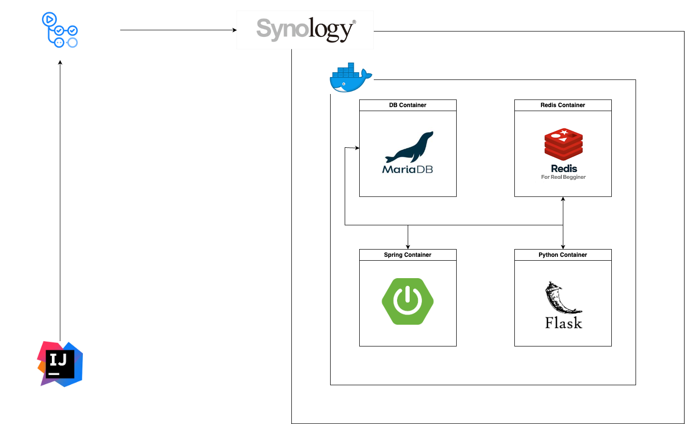

<h2>개요</h2>

프로젝트 이름: Auto Message 
프로젝트 진행 기간: 24.04.16 ~ 24.07.01 

 
<h2>사용 언어 및 기술</h2>

사용 언어 및 프레임 워크

    
    
    
    

사용 기술

    
    
    

<h2>아키텍처</h2>
<h3>시스템 아키텍처</h5>

<h3>DB ERD</h3>

 
  
<h2>주요 기능 구성</h2>

    

        Message Send (네이버 클라우드 sms 기능 사용)  
        Message Log  
        Store (CRUD)  
    

 
<h2>리팩토링</h2>
 
<h2>테스트</h2>
 
